# Animal Shelter and Operations platform
> **Important:** This repository is a learning-focused copy of `https://github.com/albdangarcia/animal-shelter.git`. It is intended purely for development and educational use; running it in production is not recommended.
**[🌐 Live Demo](https://animal-shelter-zeta.vercel.app/)** | **[📖 Documentation](#getting-started)** | **[🤝 Contributing](#contributing)**

## Project Description

This is an open-source, full-featured web application designed to be a comprehensive, end-to-end platform for animal shelters and rescue organizations. It moves beyond a simple pet listing site to provide a robust operational backbone for managing the entire lifecycle of an animal, from intake to outcome.

The platform features a public-facing portal for potential adopters and a powerful, permission-controlled dashboard for staff and volunteers to manage all aspects of shelter operations with a focus on data integrity and workflow automation.

---

## Recent Updates

These additions expand account security, user management, and localization:

* **Password Management & Recovery**
  * Public **Forgot Password** (`/forgot-password`) and **Reset Password** (`/reset-password`) pages.
  * Token-based reset flow with **hashed tokens** and **1-hour expiry** stored in the database.
  * SMTP email delivery for reset links via new `EMAIL_*` env vars (see below).
  * Settings page **Change Password** flow for signed-in users.
  * Admins can **reset a user’s password** and require a **forced change on next login**.
  * Middleware enforces **must-change-password** for users with temporary passwords.
* **User Management**
  * New **Add User** flow (`/dashboard/users/create`) with temporary passwords.
  * Role management protections to prevent assigning `ADMIN` in the UI.
* **Settings & Localization**
  * New **Settings** page (`/dashboard/settings`) with password and language controls.
  * **Language switcher** with cookie-based locale persistence (`NEXT_LOCALE`).
  * Added **next-intl** integration and message catalogs for **EN/PL/DE**.
* **Auth UX**
  * Dedicated **sign-in error** page (`/error`) with friendly error messaging.

## Core Features

The application is built around distinct, interconnected modules that handle the complex needs of a modern animal shelter.

### Animal Lifecycle Management

The system meticulously tracks an animal's entire journey through the shelter.

* **Intake Processing**: Handles various intake scenarios, including **owner surrenders**, **strays**, and **transfers** from partner organizations. It captures detailed information about the animal's origin and the people involved.
* **Re-Intake Workflow**: Provides a dedicated process for animals returning to the shelter. It automatically reactivates archived animal profiles, resets their status to `DRAFT`, and logs a new intake event, preserving the animal's complete history.
* **Outcome Management**: Manages all possible outcomes, including **adoptions**, **transfers out**, and **return-to-owner**. The system ensures data consistency with atomic operations. For example, processing an adoption:
    1.  Archives the animal's public profile.
    2.  Sets the appropriate `archiveReason` (e.g., `ADOPTED_INTERNAL`).
    3.  Updates the winning adoption application's status to `ADOPTED`.
    4.  **Automatically rejects all other open applications** for that animal, preventing conflicts and saving administrative time.

### Comprehensive Animal Profiles

Each animal has a rich, detailed profile that serves as the central hub for all its information. Staff can manage:

* **Core Details**: Update fundamental information like name, species, breed, age, weight, photos, and microchip number.
* **Characteristics Tagging**: Assign filterable tags (e.g., "Good with Kids," "Housebroken," "Heartworm Positive") to help match animals with suitable adopters. The system intelligently handles adding and removing tags in a single operation.
* **Dynamic Assessments**: Conduct standardized assessments (e.g., behavioral evaluations, medical intake exams) using **customizable templates**. The application dynamically generates forms and validation based on the selected template, ensuring consistent data collection.
* **Notes & History**: Add categorized notes (`BEHAVIORAL`, `MEDICAL`, `GENERAL`) to an animal's record. A full history of an animal's journey, status changes, and key events is logged automatically.
* **Task Management**: Create, assign, and track tasks related to a specific animal, such as "Administer medication," "Schedule vet visit," or "Behavioral follow-up." Tasks have statuses, priorities, and optional due dates.

### Adoption Application Workflow

The platform includes a complete system for managing adoption applications for both applicants and staff.

* **Public Application Portal**: Potential adopters can browse published animals, "like" their favorites, and submit detailed adoption applications directly through the platform.
* **Applicant Dashboard**: Applicants can view their submitted applications, edit them (if still pending), or withdraw them. They can also reactivate a previously withdrawn application if the animal becomes available again.
* **Staff Review & Management**: Staff have a dedicated dashboard to review and manage all incoming applications. Key features include:
    * **Status Management**: Update an application's status (`REVIEWING`, `APPROVED`, `REJECTED`, etc.) with a required reason for the change, creating a clear audit trail.
    * **Atomic Status Changes**: Approving an application automatically changes the animal's listing status to `PENDING_ADOPTION`, making it unavailable for new applications and preventing double-adoptions. If that application is later withdrawn or rejected, the system automatically makes the animal available again by setting its status back to `PUBLISHED`.
    * **Internal Notes**: Staff can add private notes to an application during the review process.

### User & Data Integrity

The system is built with security and data consistency as top priorities.

* **Role-Based Access Control (RBAC)**: Actions are protected by a permission system (`RequirePermission`). This ensures that only authorized users (e.g., `STAFF`, `ADMIN`) can perform sensitive operations like updating animal records or managing applications.
* **Account Security Controls**: Temporary passwords can be issued by admins, and users are forced to change them before accessing other dashboard pages.
* **Transactional Integrity**: Critical multi-step database operations are wrapped in **Prisma transactions**. This guarantees that all steps in a process (like an adoption or intake) either complete successfully or fail together, preventing the database from ever being left in an inconsistent state.
* **Soft Deletes**: Important records like notes and assessments are soft-deleted rather than being permanently erased, preserving historical data for auditing and potential restoration.

## Tech Stack

### Core Stack
- **Framework**: [Next.js](https://nextjs.org/) (App Router)
- **Language**: [TypeScript](https://www.typescriptlang.org/)
- **Backend**: [Node.js](https://nodejs.org/)
- **Database**: [PostgreSQL](https://www.postgresql.org/)
- **File Storage**: [Vercel Blob](https://vercel.com/docs/vercel-blob/)
- **ORM**: [Prisma](https://www.prisma.io/)
- **Authentication**: [Auth.js](https://authjs.dev/) (NextAuth)
- **Internationalization**: [next-intl](https://next-intl.dev/)
- **Email**: [Nodemailer](https://nodemailer.com/) (SMTP)

### UI & Styling
- **Styling**: [Tailwind CSS](https://tailwindcss.com/)
- **Component Library**: [shadcn/ui](https://ui.shadcn.com/) (built on [Radix UI](https://www.radix-ui.com/))
- **Forms**: [React Hook Form](https://react-hook-form.com/) with [Zod](https://zod.dev/) for validation
- **Data Visualization**: [Recharts](https://recharts.org/)
- **File Uploads**: [Uppy](https://uppy.io/) with [Vercel Blob](https://vercel.com/storage/blob)
- **Containerization**: [Docker](https://www.docker.com/)

## Screenshots

Here are a few glimpses of the platform's public-facing and internal views:

### Public Portal
Screenshots showing the interface for potential adopters.

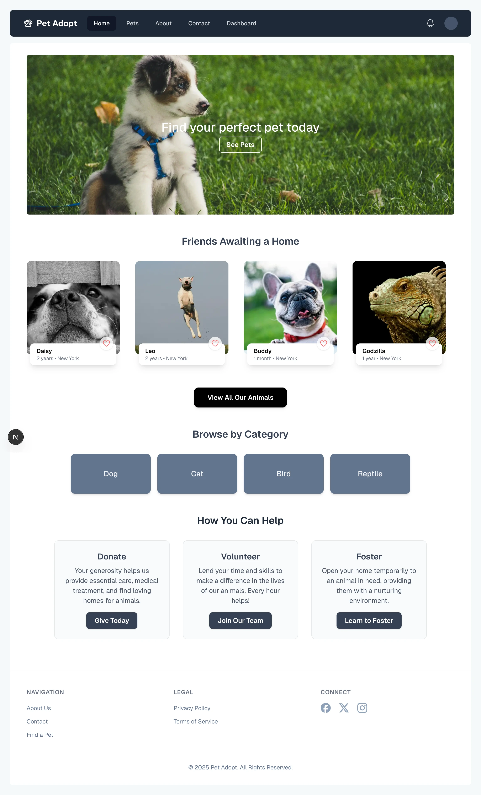

*The main landing page.*

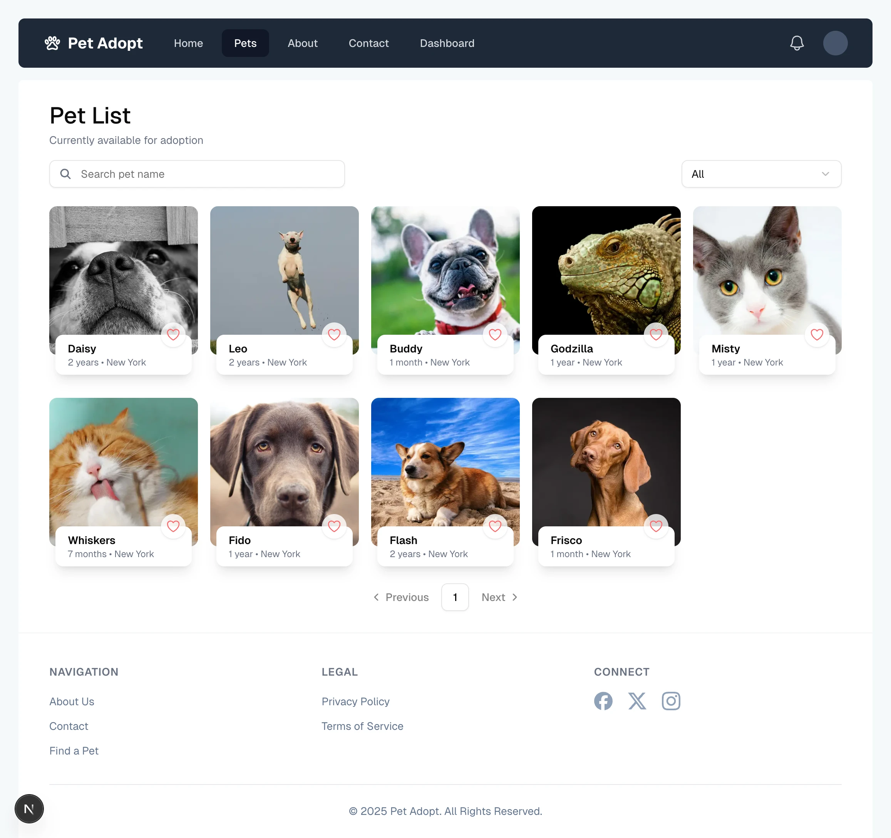

*Available pets for adoption.*

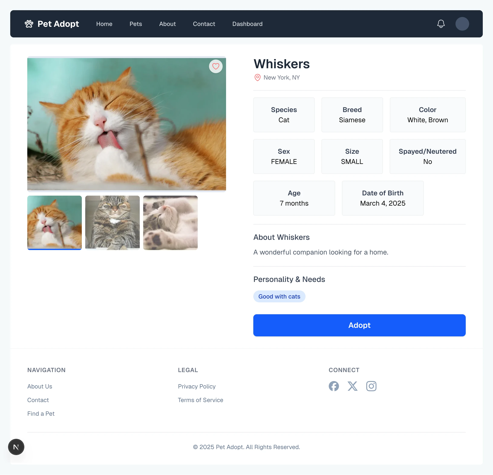

*Detailed pet information page.*

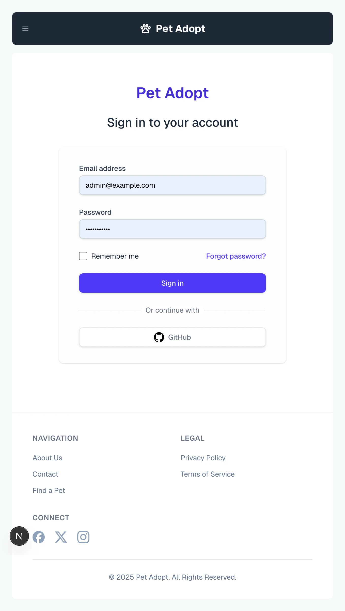

*Login page.*

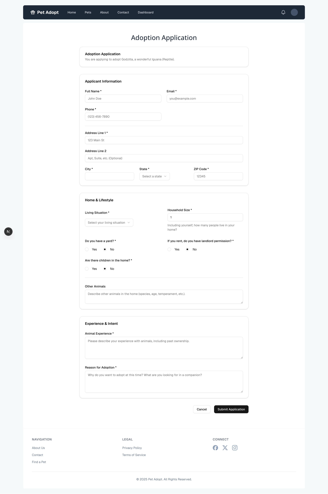

*Adoption application form*

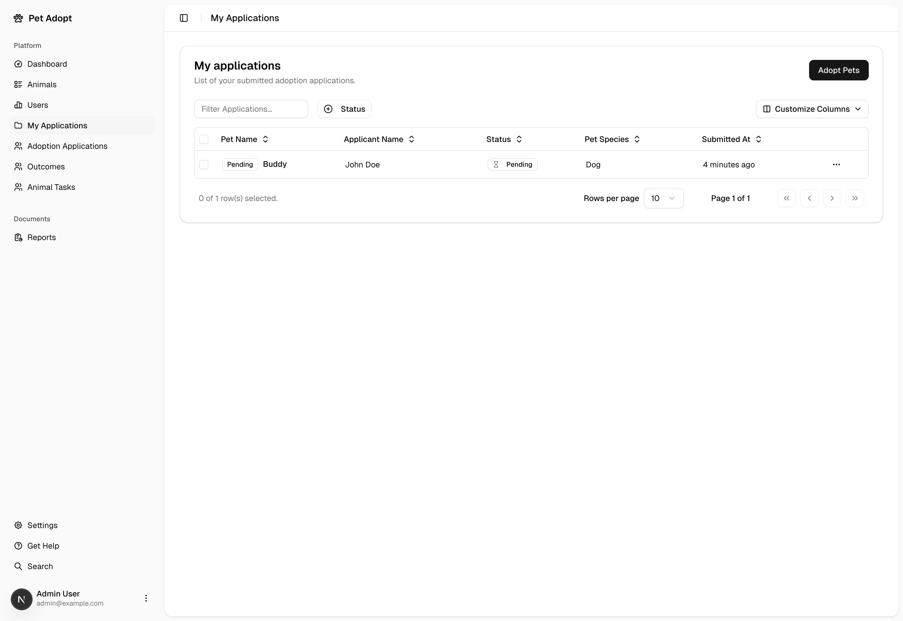

*My submitted adoption applications*

### Staff Dashboard
Screenshots of the internal operational management interface.

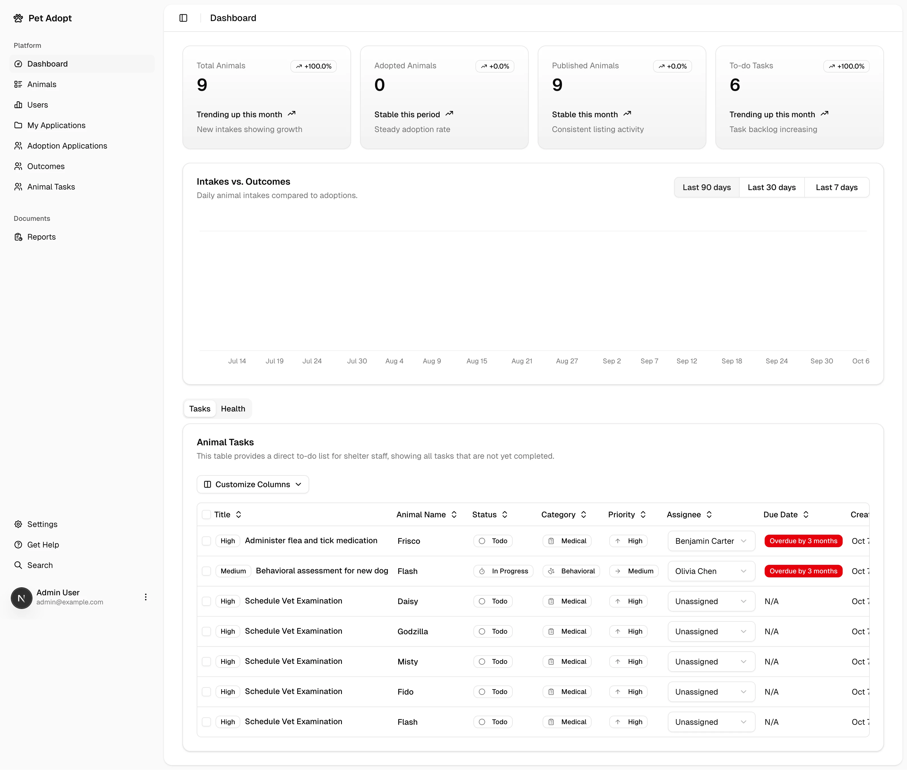

*Dashboard Analytics.*

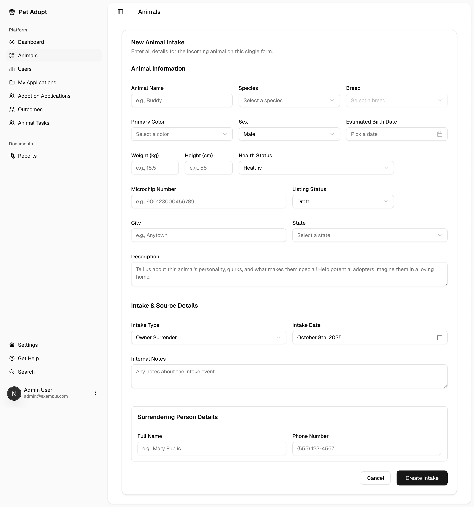

*Create a new animal form.*

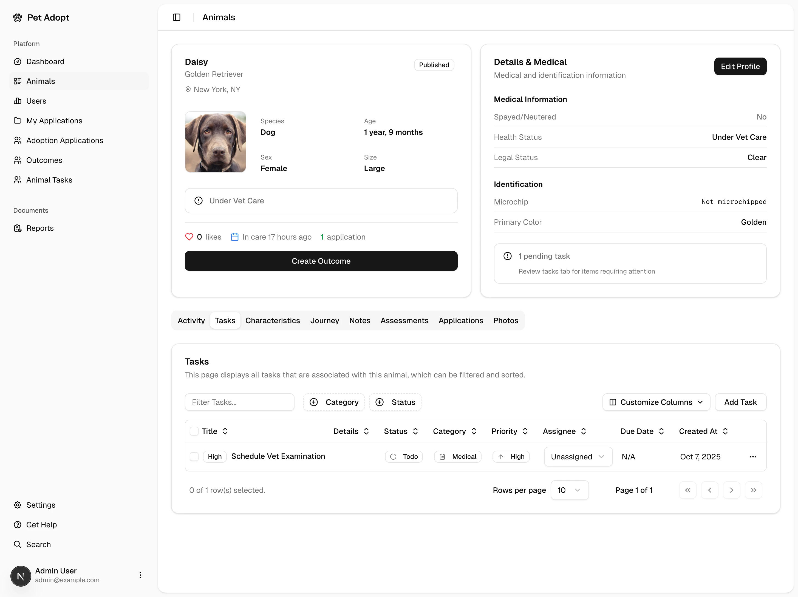

*Animal profile page.*

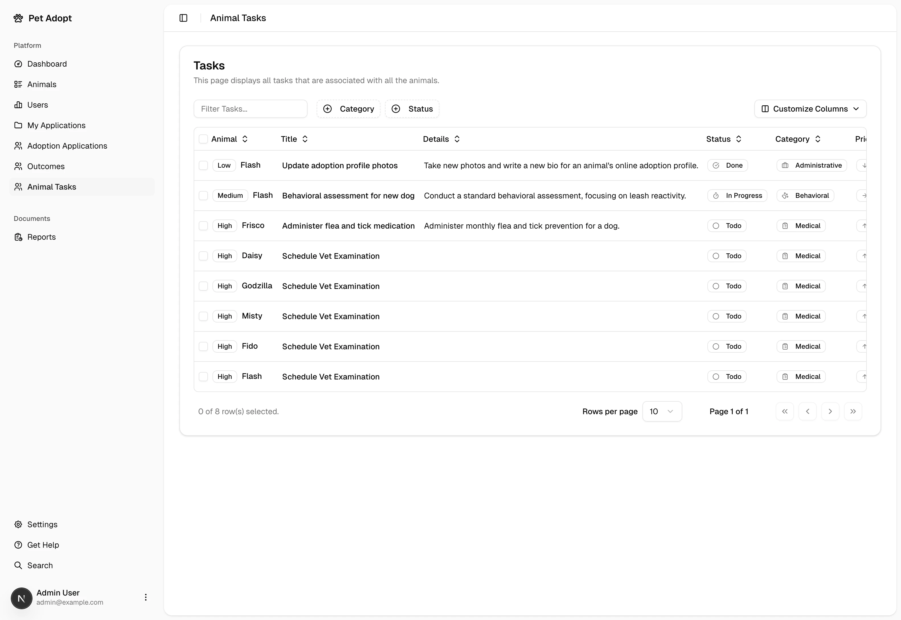

*All animal tasks.*

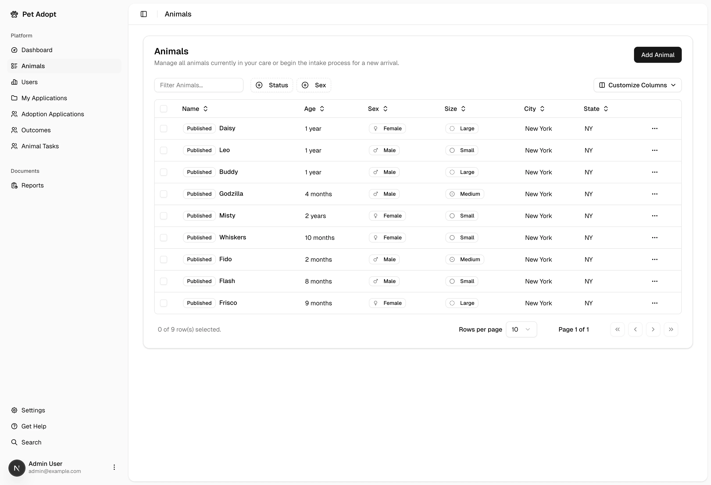

*Animal list table.*


*Subbmited adoption applications from users.*

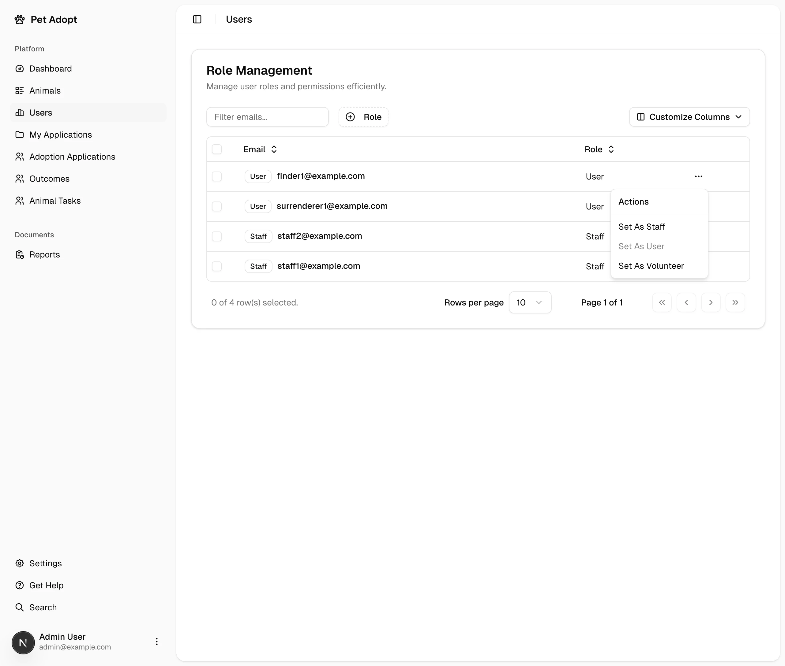

*Role management page.*

## Environment Variables

To run this project, you will need to add the following environment variables to your `.env` file:

- `AUTH_SECRET`: A secret key for authentication. You can generate a secret key by running the command `openssl rand -base64 32` in your terminal. Ensure OpenSSL is installed:
  - **macOS/Linux**: OpenSSL is usually pre-installed. Verify by running `openssl version`.
  - **Windows**: Install OpenSSL from the [OpenSSL website](https://www.openssl.org/) or using [Chocolatey](https://chocolatey.org/) with the command `choco install openssl`.
- `AUTH_GITHUB_ID` (optional): Your GitHub OAuth client ID. Obtain this from your GitHub Developer settings.
- `AUTH_GITHUB_SECRET` (optional): Your GitHub OAuth client secret. Obtain this from your GitHub Developer settings.
- `ADMIN_PASSWORD`: The password for the default admin user. This is used when seeding the database.
- `BLOB_READ_WRITE_TOKEN`: The read/write token for Vercel Blob Storage, used for storing animal images.
- `APP_URL`: Base URL for generating password reset links (e.g., `http://localhost:3000`).
- `EMAIL_FROM`: The from-address used for password reset emails.
- `EMAIL_HOST`: SMTP host for sending password reset emails.
- `EMAIL_PORT`: SMTP port for sending password reset emails.
- `EMAIL_SECURE`: Set to `true` for SMTPS/SSL (usually port 465), otherwise `false`.
- `EMAIL_USER`: SMTP username.
- `EMAIL_PASS`: SMTP password.
- `POSTGRES_USER`: The PostgreSQL database username.
- `POSTGRES_PASSWORD`: The PostgreSQL database password.
- `POSTGRES_HOST`: The PostgreSQL database host. Use `localhost` for local development or the Docker Compose service name `postgres`.
- `POSTGRES_DB`: The PostgreSQL database name.
- `POSTGRES_PORT`: The PostgreSQL database port.
- `POSTGRES_URL`: The PostgreSQL connection URL, which is constructed using the above variables.
- `DATABASE_URL`: The connection URL for your serverless PostgreSQL database (e.g., from Vercel Storage via Neon). This is typically used for production deployments.

> **Note on `AUTH_TRUST_HOST`**: While not explicitly in the `.env.example`, `Auth.js` can use `AUTH_TRUST_HOST=true` to trust the host header in development environments. This is often handled automatically in production environments like Vercel.
>
> **Note on password reset emails**: If any `EMAIL_*` variables are missing, password reset requests will return a friendly “email not configured” message instead of sending mail.

For a full list of possible environment variables, especially for serverless deployments, please refer to the `.env.example` file.

## Admin Dashboard Access

To test the admin dashboard, use the following credentials:

- **Username:** admin@example.com
- **Password:** The password you set for `ADMIN_PASSWORD` in your `.env` file.

> **Note:** Users created from the dashboard are issued temporary passwords and must change them on first login.

## Getting Started

To run this project, you will need to have the following installed:

  * [Node.js](https://nodejs.org/) (v18 or later)
  * [Docker](https://www.docker.com/) and Docker Compose
  * A free [Vercel](https://vercel.com/) account to use Vercel Blob for image storage.

### 1\. Initial Configuration

First, clone the repository and set up your environment variables.

1.  Clone the repository:
    ```sh
    git clone https://github.com/rafalglog/betti-shelter.git
    cd betti-shelter
    ```
2.  Create your local environment file:
    ```sh
    cp .env.example .env
    ```
3.  **Fill out the `.env` file**:
      * Update the `POSTGRES_*` variables. The default values in `.env.example` are configured to work with the Docker setup below.
      * Generate an `AUTH_SECRET` by running `openssl rand -base64 32`.
      * Log into your Vercel account, create a new Blob store, and get your `BLOB_READ_WRITE_TOKEN`. **This is required for all image upload/delete functionality.**

-----

## Running the App

You have two main options for running the application, depending on your goal.

### Option 1: Recommended Local Development (Docker)

This is the fastest way for contributors to get the application running on their local machine. This setup uses **Docker** to run the Next.js app and the PostgreSQL database, but still connects to **Vercel Blob** for image storage.

1.  Build and run the Docker containers:
    ```sh
    docker compose build
    docker compose up
    ```
2.  Open your browser and navigate to `http://localhost:3000`.

> **Note:** The Docker startup flow waits for Postgres to be available, runs `prisma db push`, seeds the database, and then starts the Next.js dev server.

> #### ⚠️ **A Note on Local Image Seeding**
>
> The database seeding script (`prisma db seed`) will populate the database with sample animals whose images are served from the local `/public` folder. This is done to provide a quick visual setup without requiring you to upload dozens of images manually.
>
>   * **Functionality:** You can view these seeded animals perfectly.
>   * **Limitation:** You **cannot delete** a seeded animal's image through the dashboard, as it only exists locally and not in your Vercel Blob store. Any **new animals and images you create** through the application UI will be uploaded to Vercel Blob correctly and will be fully manageable.

### Option 2: Deploying on Vercel (Fully Serverless)

This method mirrors the live production environment. It's ideal for testing the full serverless architecture or deploying your own version of the platform.

1.  **Fork the Repository** on GitHub.
2.  **Create a New Vercel Project** and connect it to your forked repository.
3.  **Set up Vercel Integrations**:
      * Add the **Vercel Postgres** integration to create a serverless database.
      * Add the **Vercel Blob** integration for image storage.
4.  **Connect Environment Variables**: Vercel will automatically provide `POSTGRES_URL` and `BLOB_READ_WRITE_TOKEN` from the integrations. Copy these and all other variables from your `.env` file into the **Environment Variables** section of your Vercel project settings.
5.  **Deploy**: Trigger a new deployment on Vercel. Your application will be live.


## Roadmap Status

### Completed (since this fork)
* **Password Management & Recovery**: Forgot/reset password flow, SMTP email support, and reset tokens with expiry.
* **Settings & Localization**: Settings page with password change and language switcher (EN/PL/DE).
* **User Management Enhancements**: Add-user flow with temporary passwords and enforced password change on login.

### Remaining (To-Do)
* **User Account Management**: Create a settings page allowing users to soft-delete their own accounts.
* **Automated Medication Tasks**: Implement a scheduler (e.g., cron job) that automatically creates tasks for staff based on active `MedicationSchedule` records to ensure doses are not missed.
* **Assessment Template Management**: Build a dashboard page for `ADMIN` users to create, view, and manage `AssessmentTemplate` records, allowing for customizable assessment forms.
* **AI-Powered Task Recommendations**: Integrate an AI service that analyzes new `Assessment` summaries and suggests relevant tasks for staff to create (e.g., suggesting a "Vet Check" task if an assessment mentions a health concern).
* **Volunteer Management & Scheduling**: Develop modules to define volunteer jobs, create schedules with shifts, and allow volunteers to sign up for specific time slots.
* **Donation & Financial Tracking**: Implement a system to log monetary and in-kind donations, track adoption fees, and maintain a complete history of financial transactions for reporting.
* **Centralized Communications Log**: Create a feature to log all communications (emails, phone calls, notes) related to animals, adoptions, or individuals, providing a complete interaction history for staff.
* **Characteristics Management Dashboard**: Implement a dedicated admin interface for creating, viewing, and managing the list of **animal characteristics** (e.g., "Good with Kids," "Deaf").
* **Enhanced Pet Listing Filters**: Add new filtering options to the public pet list page, allowing users to search and filter by **Color, Breed, and Animal Size.**

## Contributing

Please follow these steps to contribute:

1. Fork the repository.
1. Create a new branch:
    ```sh
    git checkout -b feature/your-feature-name
    ```
1. Make your changes and commit them:
    ```sh
    git commit -m 'Add some feature'
    ```
1. Push to the branch:
    ```sh
    git push origin feature/your-feature-name
    ```
1. Open a pull request.

## Credits

Credit for the royalty-free images used in this project is given below:

- **Homepage dog image:** by [Brett Sayles](https://www.pexels.com/@brett-sayles/) (via Pexels)
- **All other pet images:** by [Pixabay](https://pixabay.com/)

## License

This project is licensed under the MIT License.
